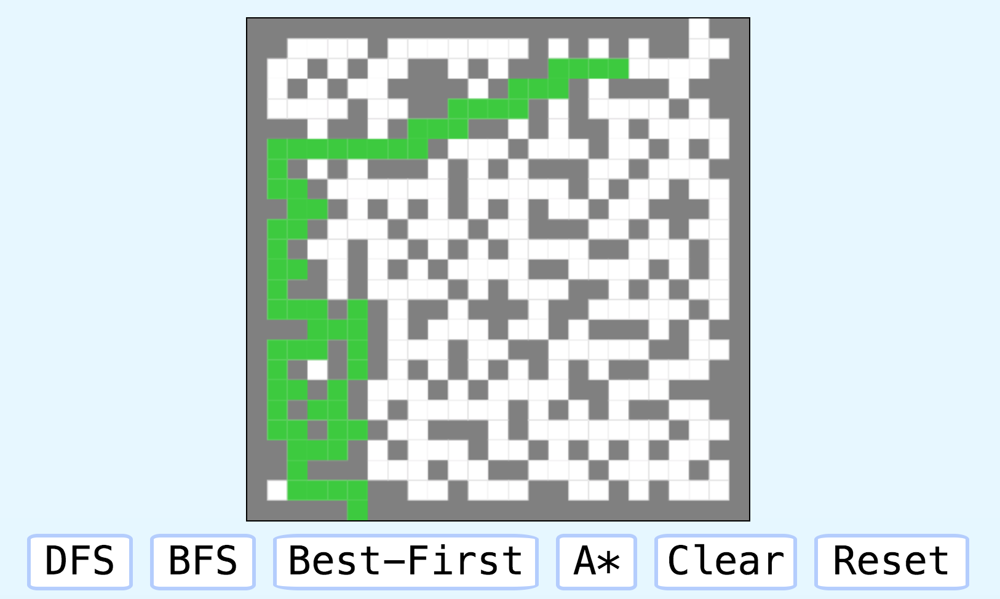

# Mazes

Use prims algorithm to generate a random maze

Use DFS,bfs, best first, A* to solve the maze

To try for yourself: `git clone https://github.com/quinnyyy/mazes.git` and open `mazes.html`  
Or: try it at [quinnyyy.me/mazes.html](quinnyyy.me/mazes.html)  

Before Running an algorithm:

While running:

Done:

